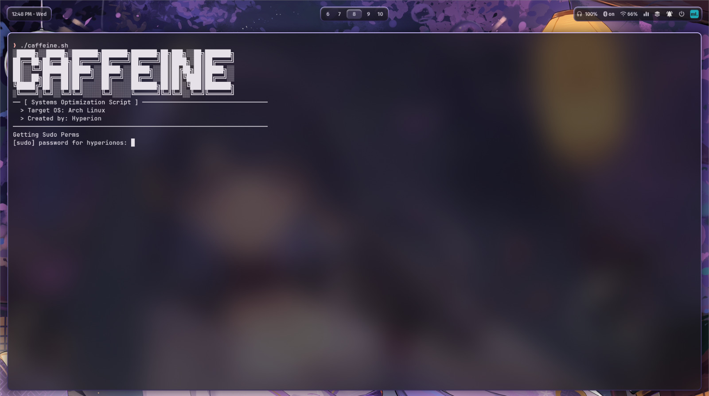

<h1 align="center">

**☕ Caffeine**



</h1>

<h2 align ="center">

_Brewed for Speed. Engineered for Arch._


</h2>

<div align="center">

Caffeine is a _lightweight_ Bash script engineered to unlock **maximum performance** on **Arch and Arch-based systems.** It forces your CPU to **stay locked at its highest turbo clock speeds** instead of dropping frequencies under light loads. This ensures **constant, uncompromised responsiveness** for _gaming and resource-heavy tasks_.

</div>

# 📘 Installation

There are 3 methods to download the script, all needing a bash commandline/terminal.

### 1. cURL (simplest)
```
curl -sSL https://github.com/HyperionOS-dev/Caffeine/releases/download/v0.2/Caffeine.sh | bash
```

### 2. Releases
Latest versions of the script will be downloadable in the Release tab of this repo. Once downloaded,
```
cd /{saved-directory}/
chmod -x caffeine.sh
./caffeine.sh
``` 

### 3. Repo Cloning
``` 
git clone https://github.com/HyperionOS-dev/Caffeine
cd Caffeine
chmod -x caffeine.sh
./caffeine.sh
```


# 🔔 Credits
- Code written by **HyperionOS-dev**.
- Repo Designer by **Glazzite**.

_**Check Them Out Via Collaborators!**_

> [!IMPORTANT]
> Licensed under **GNU 3.0 General Public License**.

<h2 align="center">
🙏 Thanks For Checking It Out!

Enjoy Brewing 💜
</h2>

<h4 align="center">
Stay on that High. ☕ 
</h4>
